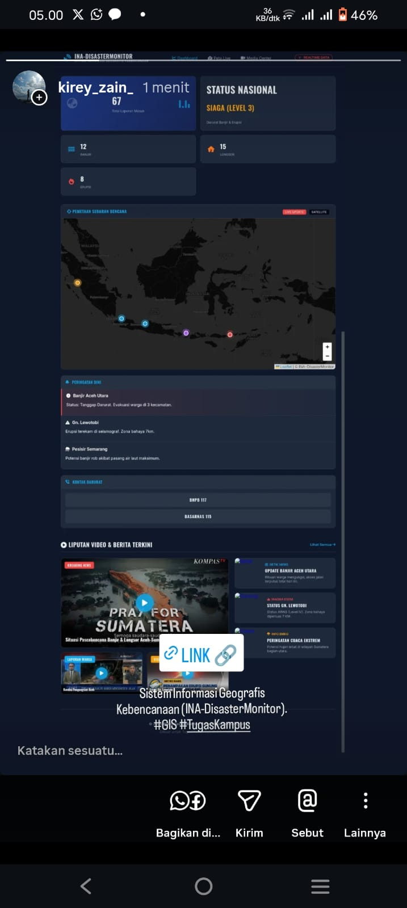

# 🌍 INA-DisasterMonitor | Disaster Command Center

**Sistem Informasi Geografis Pemantauan Bencana Alam Indonesia**
_Final Project - Mata Kuliah Sistem Informasi Geografis (GIS)_

## Tentang Project

**INA-DisasterMonitor** adalah web-based dashboard yang dirancang untuk memberikan visualisasi geospasial mengenai kejadian bencana alam terkini di Indonesia. Sistem ini mengadopsi antarmuka "Command Center" dengan mode gelap (Dark Mode) untuk memudahkan pemantauan titik lokasi, status siaga, dan liputan media secara terpusat.

🔗 **Live Demo:** [KLIK DISINI UNTUK MEMBUKA WEBSITE](https://dwifirdaus08.github.io/ina-disaster-monitor/)

## Fitur

1.  **Peta Interaktif (Leaflet.js):**
    - Menggunakan _Dark Matter Tiles_ untuk visualisasi yang kontras dan modern.
    - Marker dinamis dengan efek animasi _pulse_ (berdenyut) membedakan jenis bencana.
    - Popup interaktif yang terintegrasi dengan Google Search Query.
2.  **Dashboard Statistik:**
    - Grid layout responsif menampilkan jumlah kejadian dan status level nasional.
3.  **Media Center Terintegrasi:**
    - **Video Facade Technology:** Tampilan grid video berita dengan thumbnail HD yang ringan (anti-lemot).
    - Link berita stabil mengarah ke portal resmi (BNPB, BMKG, Detik).
4.  **Responsive Design:**
    - Tampilan optimal di Laptop (Grid Layout) maupun Smartphone (Mobile View).

## Teknologi yang Digunakan

- **Frontend:** HTML5, CSS3 (Custom Grid & Flexbox), JavaScript (ES6).
- **Mapping API:** Leaflet.js (Open Source).
- **Assets:** FontAwesome 6 (Icons), Google Fonts (Oswald & Inter).

## Dokumentasi & Bukti Publikasi

Berikut adalah bukti publikasi tugas ini di media sosial sebagai bentuk _awareness_ kebencanaan:

### Tampilan Website (Desktop)

_(Ganti 'screenshot-web.jpg' dengan nama file screenshot website kamu)_

### Bukti Share Media Sosial

|          WhatsApp Status           |          Instagram Story           |                    LinkedIn                    |
| :--------------------------------: | :--------------------------------: | :--------------------------------------------: |
|  |  |  |
